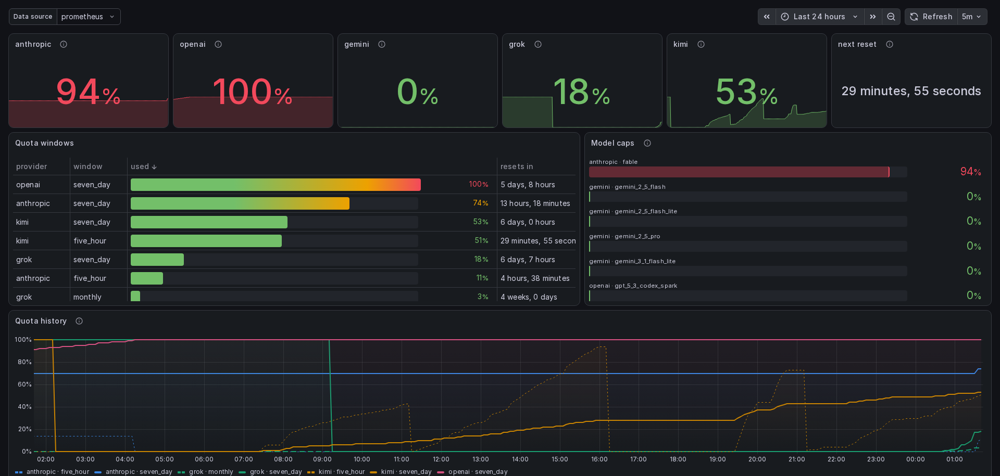

# llm-quota-exporter

Prometheus exporter for LLM **subscription** usage and rate-limit windows. It
reads the credential files the vendor CLIs already keep in your home directory
and polls each vendor's own usage endpoint, so you can see how close you are to
your Claude / Codex / Gemini / Grok / Kimi limits.

There's no official metrics endpoint for consumer LLM subscriptions; this uses
the same private, undocumented endpoints the CLIs use for their own usage
displays. They can change or break at any time. Not affiliated with any provider.

> This project, including this README, is 100% LLM-generated.



## Providers

| Provider  | Credentials read              | Endpoint |
|-----------|-------------------------------|----------|
| anthropic | `~/.claude/.credentials.json` | `api.anthropic.com/api/oauth/usage` |
| openai    | `~/.codex/auth.json`          | `chatgpt.com/backend-api/wham/usage` |
| gemini    | `~/.gemini/oauth_creds.json`  | `cloudcode-pa.googleapis.com/v1internal:retrieveUserQuota` |
| grok      | `~/.grok/auth.json`           | `cli-chat-proxy.grok.com/v1/billing` |
| kimi      | `~/.kimi-code/credentials/…`  | `api.kimi.com/coding/v1/usages` |

Providers whose credentials are absent are skipped; a failing provider keeps
its last snapshot with `llm_quota_scrape_success` 0 and backs off.

## Run

```console
$ pip install llm-quota-exporter && llm-quota-exporter --port 9184
$ nix run github:georgewhewell/quota-exporter -- --once
```

Flake outputs: `packages.default`, `overlays.default`, `nixosModules.default`
(`services.llm-quota-exporter`). Poll interval is decoupled from scrapes
(default 300 s).

## Metrics

`llm_quota_utilization_ratio{provider,window,scope}` (0–1),
`llm_quota_reset_timestamp_seconds`, `llm_quota_used` / `llm_quota_limit`,
`llm_spend_usd`, `llm_credits_balance`, `llm_provider_info{plan,tier}`, and
`llm_quota_scrape_success` / `_last_success_timestamp_seconds` / `_poll_duration_seconds`.

## Credentials

Tokens are only read, never logged or transmitted anywhere but the provider's
own endpoint. anthropic/openai are strictly read-only (they rotate refresh
tokens with reuse detection, so an outside refresh can revoke a live CLI
session); grok/kimi refresh only once the on-disk token has expired and persist
the rotated pair; gemini refreshes in memory.

A Grafana dashboard is in [`dashboards/`](dashboards/); the token/cost panels
need the CLIs' OpenTelemetry metrics in the same store (optional).

MIT.
